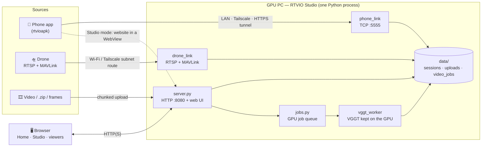
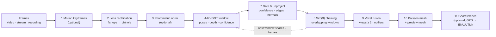
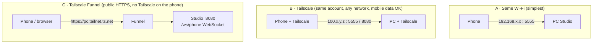

<div align="center">

# RTVIO

### Turn drone, phone and plain video footage into georeferenced 3D models — with a browser UI, an Android app, and a GPU server you run yourself.


-3DDC84?logo=android&logoColor=white)


[Quick start](#5-quick-start) ·
[Installation](#6-installation-step-by-step) ·
[Using RTVIO](#7-using-rtvio) ·
[Phone app](#8-the-android-app) ·
[Tailscale](#9-tailscale-and-remote-access) ·
[Drone](#10-drone-integration) ·
[Code tour](#11-code-tour) ·
[Troubleshooting](#16-troubleshooting)

</div>

---

## Table of contents

1. [What is RTVIO?](#1-what-is-rtvio)
2. [Highlights](#2-highlights)
3. [How it works](#3-how-it-works)
4. [Repository layout](#4-repository-layout)
5. [Quick start](#5-quick-start)
6. [Installation, step by step](#6-installation-step-by-step)
7. [Using RTVIO](#7-using-rtvio)
8. [The Android app](#8-the-android-app)
9. [Tailscale and remote access](#9-tailscale-and-remote-access)
10. [Drone integration](#10-drone-integration)
11. [Code tour](#11-code-tour)
12. [Protocols, ports and the HTTP API](#12-protocols-ports-and-the-http-api)
13. [Configuration reference](#13-configuration-reference)
14. [Performance and benchmarks](#14-performance-and-benchmarks)
15. [Testing](#15-testing)
16. [Troubleshooting](#16-troubleshooting)
17. [Security notes](#17-security-notes)
18. [Known limitations and roadmap](#18-known-limitations-and-roadmap)
19. [Contributing](#19-contributing)
20. [License and credits](#20-license-and-credits)

---

## 1. What is RTVIO?

RTVIO reconstructs a **dense coloured point cloud and a textured mesh** of a scene from ordinary video. You can feed it:

| Source | How it gets in |
|---|---|
| **A video file** (`.mp4`, `.mov`, …), a **`.zip`** of image frames or of a video, or a **folder of frames** | Upload in the web UI, or pass to the command line |
| **An Android phone** | The RTVIO Mapper app streams camera, IMU and GPS to the PC (LAN, Tailscale, or an HTTPS tunnel) |
| **A drone** | The PC reads the drone's RTSP video and MAVLink telemetry directly (no ground-station software needed) |

The heavy lifting is done by **[VGGT](https://github.com/facebookresearch/vggt)** (Meta's *Visual Geometry Grounded Transformer*): a feed-forward network that predicts camera poses and depth for a whole window of frames in a single pass. RTVIO wraps it in a complete pipeline — frame selection, lens correction, window chaining with a robust Sim(3) fit, voxel fusion, Poisson meshing, optional GPS georeferencing — and in a product around it: a browser UI called **RTVIO Studio**, a phone app, a drone link and a remote-access story built on **Tailscale**.

> **Who is this for?** People who want to go from "I have a clip of a building / field / room" to "I am looking at it in 3D" in minutes, on their own GPU, without sending data to a cloud service.

> **Project context.** RTVIO was built by a student team for a Smart India Hackathon 2026 problem statement (referenced in the code as `SIH26158`): near-real-time 3D reconstruction from UAV video with noisy GPS. It is a **research prototype** — read [Known limitations](#18-known-limitations-and-roadmap) before relying on it for measurement.

---

## 2. Highlights

- **One pipeline, three inputs.** Phone, drone and video all become the same thing — a *session* of timestamped frames — so one reconstruction, viewer and export path serves all of them.
- **RTVIO Studio** — a single Python process with a web UI: capture, job queue, live 3D preview, result viewer, settings, uploads, exports. A branded **Home** page and a **Studio** page, light/dark themed.
- **Fast by design.** Motion-based frame selection, cuDNN attention, a model that stays loaded on the GPU between jobs, and a small preview mesh that opens in seconds. On the reference clip: **231 s → 102 s** end to end ([benchmarks](#14-performance-and-benchmarks)).
- **Live reconstruction.** Watch the point cloud grow window by window while a phone or drone is still recording.
- **Drone-ready.** RTSP video + MAVLink v2 telemetry, indoor/outdoor modes, GPS anchoring, checkerboard **fisheye calibration** — or an estimated fisheye correction from the lens's field of view.
- **Phone app (`rtvioapk`)** — CameraX capture, IMU, GPS, offline recording with later transfer, and a **Studio mode** that appears when Tailscale is on: the Studio website inside the app, with *Live reconstruct* and *Enhance image quality* checkboxes.
- **Works anywhere via Tailscale** — the phone and browser reach your PC over a private encrypted network (mobile data included), or through a public HTTPS address with Tailscale Funnel. No router port-forwarding.
- **Standard outputs.** PLY point cloud and mesh, GLB/OBJ, LAS (real UTM coordinates with GPS), and a COLMAP model for Gaussian-splatting tools.
- **Tested.** 149 CPU-only Python checks + Android unit tests; see [Testing](#15-testing).

---

## 3. How it works

### 3.1 System overview



### 3.2 The reconstruction pipeline



In words:

1. **Select frames.** With *Fast mode* a Lucas–Kanade tracker measures how far the view has moved; a frame is kept when the median feature shift reaches ≈0.5 % of the frame width, and never more than 3 source frames are skipped. Hovering frames are dropped, fast turns are kept densely.
2. **Rectify the lens.** VGGT assumes a pinhole camera, so fisheye footage is remapped to an ideal pinhole image first (from a checkerboard calibration, or from a stated field of view).
3. **Normalise (optional).** One shared tone curve + light denoise + mild sharpen — identical on every frame, so matching between frames is not disturbed.
4. **Predict.** VGGT-1B reads a window of up to 64 frames at 518 px wide and outputs, per frame, a camera pose, intrinsics, a depth map and a confidence map. Attention runs through cuDNN fused kernels.
5. **Gate & unproject.** Low-confidence pixels, depth edges and grazing normals are discarded on the GPU; the rest become 3-D points.
6. **Chain windows.** Consecutive windows share frames. A robust Sim(3) (scale + rotation + translation) fit over the shared pixels maps each window onto the previous one.
7. **Fuse.** Points from every window go into one voxel accumulator (colour, normal, view count); voxels seen by fewer than `--min-views` frames are dropped and a statistical outlier filter runs → `cloud_raw.ply`.
8. **Mesh.** Screened Poisson surface reconstruction, trimmed to where there is real data, coloured from the cloud → `mesh_poisson.ply`, plus a tiny `mesh_preview.ply` for instant viewing.
9. **Georeference (optional).** With GPS, one similarity fit of the whole trajectory to the GPS track gives metric east-north-up coordinates (and UTM in the LAS export).

### 3.3 Network topologies



---

## 4. Repository layout

```text
.
├── README.md                     ← you are here
├── server command                launch notes (the PowerShell one-liner used on the dev PC)
├── vercel.json, .vercelignore    static-hosting config for the optional Vercel copy of the UI
├── deploy/vercel/build.mjs       builds the Studio web folder for Vercel, pointing it at your PC
├── images/                       third-party reference pictures used for design (credited)
│
├── rtvio/                        ── the Python side: pipeline + RTVIO Studio ──
│   ├── pyproject.toml            package metadata, extras, console scripts
│   ├── README.md                 detailed package README (pipelines, measured results, limitations)
│   ├── CHANGELOG.md, CONTRIBUTING.md, sahni1.md (development log)
│   ├── src/rtvio/
│   │   ├── vggt_reconstruct.py   batch reconstruction: frames → cloud + mesh (main entry point)
│   │   ├── vggt_live.py          live reconstruction from a phone stream / recording being written
│   │   ├── vggt_worker.py        persistent worker: VGGT loaded once, jobs run inside it
│   │   ├── fusion.py             window alignment (robust Sim(3)) + voxel accumulation
│   │   ├── surface.py            Poisson meshing, trimming, PLY read/write
│   │   ├── camera_model.py       lens profiles, calibration, undistortion, FOV-based fisheye
│   │   ├── recon_viz.py          live browser viewer served during a run
│   │   ├── view_output.py        static viewer for a finished .glb
│   │   ├── export.py             LAS / OBJ / DSM / COLMAP export
│   │   ├── georeference.py       local ENU → WGS84 → UTM (no pyproj)
│   │   ├── ai_masking.py         YOLO masking of people / vehicles (optional)
│   │   ├── stream/               phone wire protocol, clocks, geodesy, sources, replay
│   │   ├── studio/               RTVIO Studio: server, phone/drone links, job queue, web UI
│   │   └── (legacy) live_pipeline.py, tracking.py, dense_stereo.py, meshing.py, viz_server.py, …
│   ├── tools/                    start_studio_server.ps1, mock_drone.py, calibration & import helpers
│   ├── tests/                    9 plain-Python test scripts (CPU only)
│   ├── third_party/vggt/         Meta's VGGT code (git submodule)
│   └── data/                     models, sessions, uploads, jobs, settings   (git-ignored, created on use)
│
└── rtvioapk/                     ── the Android app "RTVIO Mapper" (Kotlin) ──
    ├── app/src/main/java/com/rtvio/mapper/{ui,service,capture,sensors,net,data}/
    ├── app/src/test/             JVM unit tests
    ├── tools/mock_receiver.py    a stand-in desktop receiver for testing the app alone
    └── README.md                 app-specific build/usage notes
```

What is *not* in git (see `.gitignore`): model weights, `rtvio/data/`, build outputs, large videos, the abandoned `rtviomap/` and `rtvioimu/` experiments.

---

## 5. Quick start

> You need a computer with an **NVIDIA GPU** and a few GB of disk. Details and explanations are in [Installation](#6-installation-step-by-step).

```powershell
# 1. get the code (note --recurse-submodules: VGGT comes as a submodule)
git clone --recurse-submodules https://github.com/Jola7898/Terraform.git Terraform
cd Terraform\rtvio

# 2. Python environment
python -m venv .venv
.\.venv\Scripts\Activate.ps1

# 3. PyTorch for YOUR GPU (pick the right line at https://pytorch.org/get-started/locally/)
python -m pip install torch torchvision --index-url https://download.pytorch.org/whl/cu128

# 4. RTVIO + everything it needs
python -m pip install -e ".[vggt,mesh,masking]"

# 5. start the Studio (downloads the ~5 GB VGGT weights on first use)
python -m rtvio.studio --open
```

Your browser opens **http://127.0.0.1:8080**. Go to **RTVIO Studio → Video file → Upload video or .zip & reconstruct**, pick a clip, wait a minute or two, then press **View mesh**.

No video handy? Any phone clip of a building or a room, walked around slowly, works.

---

## 6. Installation, step by step

This guide assumes nothing. **Windows 11 is the tested platform** (every command below was used on it). Linux/macOS notes are given where they differ, but the PowerShell helper scripts and GPU monitoring are Windows/NVIDIA-specific — see [Known limitations](#18-known-limitations-and-roadmap).

### 6.1 What you need

| Requirement | Why | Notes |
|---|---|---|
| **NVIDIA GPU** with a current driver | VGGT runs on CUDA | ≥ 4 GB VRAM works (windows shrink automatically), 8 GB+ recommended. Developed on an RTX 5070 Ti (16 GB); the code comments also record a 4 GB GTX 1650. CPU-only runs work but are extremely slow. |
| **Python 3.10 – 3.13** | the whole backend | Developed on 3.13. [python.org](https://www.python.org/downloads/) → tick **"Add python.exe to PATH"** in the installer. |
| **Git** | clone + submodule | [git-scm.com](https://git-scm.com/downloads) |
| **~15 GB free disk** | PyTorch (~3 GB), VGGT weights (~5 GB), outputs | Reconstructions can be hundreds of MB each (the depth-10 mesh alone may be ~270 MB). |
| *Optional:* **JDK 17 + Android SDK 34** | only to build the phone app | See [§6.9](#69-optional-build-the-android-app). |
| *Optional:* **Tailscale** | remote access, phone on mobile data | See [§6.10](#610-optional-tailscale). |
| *Optional:* **Node.js** | only for the Vercel-hosted UI | See [§6.11](#611-optional-host-the-ui-on-vercel). |

Check what you already have:

```powershell
python --version        # 3.10 – 3.13
git --version
nvidia-smi              # shows your GPU, driver and "CUDA Version"
```

If `nvidia-smi` is not found, install the driver from [nvidia.com/drivers](https://www.nvidia.com/drivers).

### 6.2 Get the code

```powershell
git clone --recurse-submodules https://github.com/Jola7898/Terraform.git Terraform
cd Terraform
```

Already cloned without the flag? Fetch the VGGT submodule now:

```powershell
git submodule update --init --recursive
```

> The remote also has a `linux-dev` branch for Linux work (not reviewed while writing this README).

Sanity check: `rtvio\third_party\vggt\vggt\models\vggt.py` must exist. If `third_party\vggt` is empty, the submodule did not download — run the command above.

### 6.3 Create a Python environment

A virtual environment keeps RTVIO's packages separate from the rest of your machine.

```powershell
cd rtvio
python -m venv .venv
.\.venv\Scripts\Activate.ps1      # Linux/macOS:  source .venv/bin/activate
python -m pip install --upgrade pip
```

If PowerShell refuses to run the activation script: `Set-ExecutionPolicy -Scope CurrentUser RemoteSigned`, then retry. Your prompt now starts with `(.venv)`. **Activate it in every new terminal** before running RTVIO.

### 6.4 Install PyTorch (the one step people get wrong)

PyTorch must match your GPU, so it is installed **separately** (RTVIO's extras deliberately leave it out). Open <https://pytorch.org/get-started/locally/>, choose *Pip → Python → your CUDA version*, and run the command it prints. Typical examples:

```powershell
# CUDA 12.8 build — required for RTX 50-series ("Blackwell") GPUs
python -m pip install torch torchvision --index-url https://download.pytorch.org/whl/cu128

# CUDA 12.4 / 12.6 builds for older cards: replace cu128 with cu124 or cu126
```

> The development machine runs a PyTorch **nightly** (`2.12.0.dev…+cu128`) on an RTX 5070 Ti. Stable wheels with CUDA 12.8 support also work on that hardware; if a stable build does not recognise a brand-new GPU, use the nightly index from the PyTorch page.

Verify:

```powershell
python -c "import torch; print(torch.__version__, torch.cuda.is_available(), torch.cuda.get_device_name(0))"
```

It must print `True` and your GPU's name. If it prints `False`, the wrong (CPU) wheel was installed — uninstall (`pip uninstall torch torchvision`) and repeat with the right index URL.

### 6.5 Install RTVIO

```powershell
python -m pip install -e ".[vggt,mesh,masking]"
```

`-e` (editable) means the installed package *is* your checkout — edits under `src\rtvio\` apply immediately. The extras:

| Extra | Installs | What for |
|---|---|---|
| *(core)* | numpy, opencv-python, scipy, laspy | everything |
| `vggt` | huggingface_hub, einops, safetensors | running VGGT-1B |
| `mesh` | pymeshlab, trimesh | Poisson meshing, GLB export. Without it you still get the point cloud. |
| `masking` | ultralytics, huggingface_hub | optional YOLO masking of people/vehicles |
| `dev` | pytest | optional; the project's tests are plain scripts |

Confirm Python imports **this** checkout (a classic trap when a project is cloned twice — see [Troubleshooting](#16-troubleshooting)):

```powershell
python -c "import rtvio; print(rtvio.__file__)"
```

### 6.6 Get the VGGT weights

RTVIO loads VGGT-1B from, in order:

1. the path in the environment variable `RTVIO_VGGT_CHECKPOINT`, else
2. `rtvio\data\models\vggt1b_model.pt`, else
3. **Hugging Face** `facebook/VGGT-1B`, downloaded automatically on first run (~5 GB, cached under `%USERPROFILE%\.cache\huggingface`).

So you can do nothing and let the first reconstruction download it, or pre-fetch it once:

```powershell
mkdir data\models -ErrorAction SilentlyContinue
curl.exe -L -o data\models\vggt1b_model.pt https://huggingface.co/facebook/VGGT-1B/resolve/main/model.pt
```

> Check the model card and the [VGGT licence](rtvio/third_party/vggt/LICENSE.txt) on Hugging Face/GitHub for the terms that apply to these weights, especially for commercial use.

### 6.7 Verify the installation

```powershell
# the test suite (CPU only, a few seconds each) — every line should end "0 failed"
python tests/test_geometry.py
python tests/test_stream.py
python tests/test_fusion.py
python tests/test_camera_model.py

# the command line tools respond
python -m rtvio.vggt_reconstruct --help
python -m rtvio.studio --help
```

### 6.8 Run RTVIO Studio

**On this PC only** (the safe default — no password needed, bound to `127.0.0.1`):

```powershell
python -m rtvio.studio --open
```

**So your phone / other computers can reach it** (LAN or Tailscale): the Studio can start your phone's camera and run GPU jobs, so it insists on a password whenever it is reachable from elsewhere.

```powershell
$env:RTVIO_STUDIO_PASSWORD = "choose-something-long"
python -m rtvio.studio --web-host 0.0.0.0
```

…or use the helper, which also opens the Windows firewall **only** for your LAN and for Tailscale (`100.64.0.0/10`), asks for a password once and remembers it, and optionally publishes the Studio with Tailscale Funnel. **Run it from an *administrator* PowerShell the first time** (firewall rules need it):

```powershell
cd rtvio
powershell -ExecutionPolicy Bypass -File tools\start_studio_server.ps1          # LAN + Tailscale
powershell -ExecutionPolicy Bypass -File tools\start_studio_server.ps1 -Funnel  # + public HTTPS via Tailscale Funnel
```

Ports the Studio uses:

| Port | What | Flag |
|---|---|---|
| **8080** | web UI and API | `--port` |
| **5555** | the phone's stream (raw TCP) | `--phone-port` |
| **8767** | live 3-D viewer of the running job (proxied under `/viz/`) | `--recon-viz-port` |

> **Port 5555 is also adb's port.** If you use Android's `adb` tool, see [Troubleshooting](#16-troubleshooting) — an adb server scanning 5555 once knocked the phone off the Studio every second.

### 6.9 Optional: build the Android app

You can skip this if you only use video uploads or a drone.

1. Install **JDK 17** (e.g. [Temurin 17](https://adoptium.net/)) and **Android Studio** (or just the command-line tools). In the SDK Manager install **Android SDK Platform 34** and **Build-Tools 34**.
2. Tell Gradle where the SDK is — create `rtvioapk\local.properties` (forward slashes!):
   ```properties
   sdk.dir=C:/Users/<you>/AppData/Local/Android/Sdk
   ```
3. Build:
   ```powershell
   cd rtvioapk
   $env:JAVA_HOME = "C:\Program Files\Eclipse Adoptium\jdk-17..."   # if `java -version` is not 17
   .\gradlew.bat test assembleDebug
   ```
   The APK lands at `rtvioapk\app\build\outputs\apk\debug\app-debug.apk` (~8 MB).
4. Install it: copy the APK to the phone and open it (allow "install unknown apps"), **or** enable USB debugging and run `adb install -r app-debug.apk`.
5. First launch: grant **Camera** (and **Location** for outdoor GPS, **Notifications** on Android 13+).

Full app details: [§8](#8-the-android-app) and [`rtvioapk/README.md`](rtvioapk/README.md).

### 6.10 Optional: Tailscale

Tailscale is a free private network ("tailnet") that gives each of your devices a fixed `100.x.y.z` address that works on any network — including mobile data — without opening ports on your router.

1. Create an account at <https://tailscale.com> (sign in with Google/Microsoft/GitHub).
2. Install Tailscale on the **PC** ([download](https://tailscale.com/download)) and sign in.
3. Install the Tailscale app on the **phone** and sign in **with the same account**.
4. Note the PC's tailnet address: `tailscale ip -4` in PowerShell (or the admin console). Example: `100.100.127.114`.
5. Start the Studio with `--web-host 0.0.0.0` and a password ([§6.8](#68-run-rtvio-studio)).
6. In the phone app → **Settings → Server IP** = that `100.x.y.z` address, **Studio password** = your password.

The full story, including Funnel and drones, is in [§9](#9-tailscale-and-remote-access).

### 6.11 Optional: host the UI on Vercel

Only needed if you want the web UI served from a public static host while the PC does the work (it then talks to your PC through a Funnel/Cloudflare tunnel). The Studio itself already serves the same UI, so most people can skip this.

```powershell
$env:RTVIO_API_URL = "https://<pc>.<tailnet>.ts.net"     # your PC's public https origin
node deploy/vercel/build.mjs                              # writes deploy/vercel/dist/
```

Point a Vercel project at the repo (`vercel.json` already sets the build command and output directory), set `RTVIO_API_URL` in its environment variables, and start the PC with `--cors-origin https://your-app.vercel.app` (or `-AllowOrigin` in the helper script).

---

## 7. Using RTVIO

### 7.1 The Studio web app

Open **http://127.0.0.1:8080** (or `http://<PC address>:8080`). The top ribbon has two pages:

- **Home** — what RTVIO is, the methodology, architecture diagrams, benchmarks, a comparison with COLMAP/classical pipelines.
- **RTVIO Studio** — the tool itself. (Home is dark-themed, the Studio is light-themed; the settings panel, output viewer and live-watch window stay dark.)

The Studio page:

| Area | What it does |
|---|---|
| **Settings · reconstruction** (top, collapsible) | Frames per window, overlap, stride, confidence percentile, voxel factor, minimum views, Poisson depth, GPS mode, masking, extra exports |
| **Drone / Phone** tabs (left) | Live preview, connection status, Indoor/Outdoor switch, **Live reconstruct** and **Enhance image quality** checkboxes, **Start recording**, lens calibration, drone connection |
| **Video file** (right) | Upload a clip, a `.zip`, or a frames folder — with the options below |
| **Sessions** | Every take and upload, with progress, **Watch live**, **View cloud / mesh**, downloads, re-run, delete, import/export `.zip` |
| **Event log** | What the phone/drone/jobs are doing |

### 7.2 Reconstruct a video, a zip or a folder of frames

**Video file → Upload video or .zip & reconstruct**, then pick one of:

- an **mp4/mov/…** clip,
- a **`.zip`** containing a video (the largest video inside is used) **or** image frames in sequence (nested folders are fine; files are ordered naturally, so `IMG_2` precedes `IMG_10`),
- *or*, under "…or a file or folder of frames already on the Studio PC", a path on the server.

Tick options **before** choosing the file:

| Option | Effect | Use it when |
|---|---|---|
| **Fast mode** (default on) | Keeps a frame only when the camera has moved ≈0.5 % of the frame width (never skipping more than 3). ~2× faster with denser, cleaner surfaces than every-frame. | almost always; untick for very short clips or to use every frame |
| **Fisheye correction** (+ field of view, e.g. 124° × 60°) | Undistorts wide-angle footage with an *estimated* equidistant lens before VGGT | drone footage without a real calibration. A checkerboard calibration is more accurate. |
| **Image enhancement** | One shared tone curve + light denoise + mild sharpen on every frame | low-quality footage; it cannot add detail that is not in the video — compare with and without |

When the job finishes, the session shows **View mesh** / **View cloud**.

### 7.3 Phone workflow

1. Start the Studio with a password and `--web-host 0.0.0.0` ([§6.8](#68-run-rtvio-studio)).
2. Phone app → **Settings → Server IP** = the PC's address (LAN `192.168.x.x` or Tailscale `100.x.y.z`), **Studio password** if set.
3. Tap **CONNECT**. The phone is now *armed*: the Studio's **Phone** tab shows its camera.
4. In the Studio (or with the app's ● REC button) press **Start recording**. Tick **Live reconstruct** to watch the model grow while you record.
5. Move **through** the scene rather than panning in place — parallax is what reconstruction needs. Slow, steady, with overlap.
6. **Stop** → the take is saved to `data/sessions/<timestamp>/` and reconstructed automatically.

No network at the time? **RECORD LOCALLY** in the app saves to the phone; later use **☰ → Saved sessions → Transfer**.

### 7.4 Drone workflow

See [§10](#10-drone-integration) — in short: enter the drone's IP in **Drone connection**, calibrate the lens once, choose Indoor/Outdoor, **Start recording**.

### 7.5 Command line

Everything the Studio does is a command you can run yourself.

```powershell
# video (or a frames folder) → cloud + mesh
python -m rtvio.vggt_reconstruct --video clip.mp4 --out data/outputs/demo --keyframes

# a recorded phone/drone session
python -m rtvio.vggt_reconstruct --from-recording data/sessions/<id> --out data/outputs/demo

# georeferenced: GPS CSV with columns timestamp_s,lat_deg,lon_deg,alt_m
python -m rtvio.vggt_reconstruct --video clip.mp4 --gps track.csv --out data/outputs/geo

# drone clip with an estimated fisheye lens + enhancement, watching it live in a browser tab
python -m rtvio.vggt_reconstruct --video drone.mp4 --out data/outputs/d --keyframes --fisheye-fov 124 60 --enhance --live-viz --open

# live reconstruction from a phone streaming straight into the command line tool
python -m rtvio.vggt_live --out data/outputs/live1 --live-viz --open

# look at a finished result (needs --extras for the .glb)
python -m rtvio.view_output data/outputs/demo --open
```

Useful flags (full list: `--help`):

| Flag | Meaning |
|---|---|
| `--keyframes`, `--keyframe-shift`, `--keyframe-gap` | motion-based frame selection (video only) |
| `--fisheye-fov H [V]` | estimated fisheye correction from the field of view, degrees |
| `--intrinsics file.json` | a calibration (e.g. `data/drone_camera.json`); `--no-undistort` to ignore it |
| `--enhance` | shared tone curve + denoise + sharpen |
| `--window-frames N\|auto`, `--overlap K` | VGGT window size / shared frames |
| `--conf-percentile`, `--edge-threshold`, `--min-views`, `--voxel-factor` | quality gates and density |
| `--poisson-depth D` | mesh resolution (8 fast/small … 10 detailed/huge) |
| `--gps FILE`, `--gps-mode off\|global` | georeferencing |
| `--extras` | also LAS, OBJ/GLB, COLMAP export |
| `--masking` | YOLO-mask people/vehicles |
| `--no-mesh` | point cloud only |

Helper scripts in `rtvio/tools/`: `mock_drone.py` (fake drone), `calibrate_camera.py` (offline checkerboard calibration), `capture_calibration_frames.py`, `import_frames_as_session.py` (turn a frames folder into a Studio session).

### 7.6 Outputs and session layout

**A reconstruction** writes (in `data/sessions/<id>/recon-N/`, `data/video_jobs/<name>-N/`, or `--out`):

| File | What it is |
|---|---|
| `cloud_raw.ply` | dense coloured point cloud (binary PLY, per-point normals + view count) |
| `mesh_poisson.ply` | full-resolution Screened-Poisson mesh |
| `mesh_preview.ply` | ~4 MB quick-look mesh; the viewers open this first |
| `cameras.json` | per-frame pose + intrinsics in the cloud's frame |
| `CHECKPOINT_REPORT.md` / `.json` | speed & quality report (frames, windows, fps, seam scales, blur, mesh stats) |
| `trajectory_check.png` | plot of the camera path |
| `job.log`, `progress.json` | the run's log and live progress |
| *with `--extras`* `mesh_poisson.obj/.glb`, `cloud.las`, `colmap/` | other formats; LAS carries real UTM coordinates when GPS was used |

**A session** (what the phone and drone write, and what `--from-recording` reads):

```text
data/sessions/<timestamp>[-drone]/
├── frames/000000.jpg …           the JPEG frames
├── frame_timestamps.json         per-frame time
├── gps_data.json                 GPS fixes (empty indoors)
├── imu_data.json                 IMU samples (phone)
├── camera_intrinsics.json        intrinsics / lens calibration scaled to this take
├── session_meta.json, flight_config.json
├── drone_telemetry.json          every MAVLink message received (drone takes)
└── recon-1/, recon-2/ …          reconstructions of this session
```

### 7.7 Viewer controls

| Action | Output viewer and live-watch window |
|---|---|
| Left-drag | Rotate the model freely in any direction |
| **Alt**-drag, or **Q / E** | Roll about the line of sight |
| Right-drag, or Shift/Ctrl-drag | Pan |
| Scroll | Zoom |
| Two-finger twist / pinch (touch) | Roll / zoom |
| Sliders (tilt, turn, roll) | Set the orientation numerically; it is remembered |
| **Flip upside-down**, **Default rotation** | 180° flip (the default view is flipped) / back to default |
| **Full detail** (meshes) | Load the full-resolution mesh instead of the preview |
| **Back** (browser or phone) | Closes the viewer and stays in the Studio |

---

## 8. The Android app

**RTVIO Mapper** (`rtvioapk/`, package `com.rtvio.mapper`, Kotlin 1.9, Gradle 8.2 / AGP 8.2.2, minSdk 24, targetSdk 34) does **acquisition and transmission only**. The 3-D model is always built on the PC.

### 8.1 What it does

- **CONNECT** to a desktop receiver and stream live, or — against RTVIO Studio — sit *armed* (viewfinder going to the Studio) while takes are started/stopped from the Studio page or the app's ● REC button.
- **RECORD LOCALLY** with no network, then **Saved sessions → Transfer** later.
- Streams JPEG frames, batched IMU samples, GPS fixes and camera intrinsics; spools frames to disk so a network drop loses nothing during a recording.
- **Phone specs** screen (camera, sensors, battery, uplink estimate).

### 8.2 Connection modes (Settings → Server IP)

| You enter | The app uses |
|---|---|
| `192.168.1.42` (LAN address) | raw TCP to port 5555. **Requires Wi-Fi.** |
| `100.100.127.114` or `pc.tailnet.ts.net` (tailnet address) | raw TCP over Tailscale; works on **Wi-Fi or mobile data** while Tailscale is on |
| `https://pc.tailnet.ts.net` (Funnel/Cloudflare URL) | a WebSocket to `/ws/phone` carrying the same byte stream; works on any network, signs in with **Studio password** |

### 8.3 Studio mode (Tailscale)

When Tailscale is **on** and the Studio answers at the configured tailnet address, a **Studio card** appears on the main screen. Without Tailscale, or on a different tailnet, the card never appears and the app behaves exactly as it always did.

- **Open Studio** — the Studio website in a WebView overlay (an overlay in the same activity, not a second one, because the camera is bound to the main activity and would stop). Sessions, the 3-D viewer, live watch, uploads and downloads all work inside it; Back closes the 3-D viewer first.
- **Live reconstruct** and **Enhance image quality** checkboxes apply to the next take; **● REC** starts it through the Studio API, **■ STOP** ends it.
- The card follows the take — recording → reconstructing (with the job's progress) → done, at which point the result viewer opens by itself; **View result** reopens it.
- **Auto-connect in Studio mode** (Settings, on by default) connects the phone without pressing CONNECT.
- Off Wi-Fi, the card shows roughly how much **mobile data** a minute of recording uses.

The app cannot read which Tailscale account it is signed in to; "same account" is inferred from *a tailnet address on the phone + the Studio answering there*.

### 8.4 Settings worth knowing

Server IP · Studio password · Server port (5555) · **Studio web port** (8080) · Auto-connect in Studio mode · resolution (720p/1080p) · aspect (4:3/16:9) · FPS · JPEG quality · IMU rate · indoor/outdoor (GPS) · auto-reconnect.

The defaults (720p, 4:3, quality 85) are deliberate: VGGT shrinks everything to 518 px anyway, so larger frames only cost bandwidth and encode time.

### 8.5 Theme

The app uses the same dark palette as the website's Home page (near-black background, slate cards, soft-blue and teal accents); the Studio WebView keeps the Studio's light theme.

### 8.6 Testing the app without the Studio

`python rtvioapk/tools/mock_receiver.py` is a minimal desktop receiver that accepts the app's stream and logs it.

---

## 9. Tailscale and remote access

### 9.1 Why Tailscale?

The Studio's three inputs are not all HTTP: the phone sends a **raw TCP stream**, the drone speaks **RTSP and MAVLink**. Web tunnels (Cloudflare, ngrok) only carry web traffic; Tailscale carries *everything*, encrypted, with no router configuration.

### 9.2 Three ways to reach your PC

| Mode | Phone needs Tailscale? | Address you use | Good for |
|---|---|---|---|
| **A. Same Wi-Fi** | no | `192.168.x.x` | at home/lab |
| **B. Tailnet** | **yes**, same account | `100.x.y.z` or `pc.tailnet.ts.net` | anywhere, incl. mobile data; best quality; also opens the Studio in the app |
| **C. Funnel** | no | `https://pc.tailnet.ts.net` | sharing the Studio/UI publicly; the phone on a device without Tailscale |

### 9.3 Mode B, step by step

1. Install Tailscale on the PC and the phone; sign both in with the **same account** ([§6.10](#610-optional-tailscale)).
2. Start the Studio reachable from the tailnet (password required):
   ```powershell
   powershell -ExecutionPolicy Bypass -File tools\start_studio_server.ps1
   ```
   It opens TCP **8080** and **5555** for your LAN and for `100.64.0.0/10` only, and prints `Tailscale: phone app / your devices -> 100.x.y.z`.
3. Phone app → Settings → **Server IP** `100.x.y.z`, **Studio password**, leave the ports. The Studio card appears once Tailscale is on.
4. From any laptop on the tailnet, the Studio is at `http://100.x.y.z:8080`.

### 9.4 Mode C: Tailscale Funnel

```powershell
powershell -ExecutionPolicy Bypass -File tools\start_studio_server.ps1 -Funnel
```

This runs `tailscale funnel --bg 8080`, publishing `https://<pc>.<tailnet>.ts.net` → your Studio, and prints the URL (the first run asks you to enable HTTPS certificates and Funnel for your tailnet in the admin console). `-NoFunnel` turns it off. The phone app uses it by entering that `https://…` address as Server IP — the stream travels over the Studio's `/ws/phone` WebSocket. **Anyone with the URL can reach the sign-in page; the password is your only protection — make it long.**

### 9.5 A drone over Tailscale

The Studio connects *out* to the drone's IP, so the drone's network must be reachable from the PC. In the field, a laptop joined to the drone's Wi-Fi acts as a **subnet router**:

```powershell
# on the field laptop (joined to the drone's Wi-Fi, with Tailscale installed)
tailscale up --advertise-routes=10.66.229.0/24      # the drone's subnet
```

Approve that route in the Tailscale admin console (*Machines → the laptop → Edit route settings*); the PC accepts it (automatic on Windows; `--accept-routes` on Linux). Then set the drone's normal IP in the Studio's **Drone connection** card. The laptop needs another way to reach the internet (a phone hotspot or second adapter) while it sits on the drone's Wi-Fi. Video now travels over the internet, so re-measure the **Video delay** before a GPS-georeferenced flight.

### 9.6 Checking it works

```powershell
tailscale status                          # both devices listed and online
curl http://100.x.y.z:8080/api/health     # {"ok":true,"service":"rtvio-studio",…}
```

---

## 10. Drone integration

The Studio's **Drone** tab talks to the aircraft directly, the same way the iDronam ground station does, so no GCS software needs to be running:

| Link | Details |
|---|---|
| **Video** | `rtsp://<drone IP>:10000/drone_cam` over TCP, decoded by OpenCV's bundled FFmpeg |
| **Telemetry** | MAVLink v2 over TCP to `<drone IP>:14550` (GCS identity system 255 / component 1), a small built-in codec (`studio/mavlink.py`, no `pymavlink`) |

### 10.1 Connect

1. Put the PC on the drone's network (or route to it with Tailscale, [§9.5](#95-a-drone-over-tailscale)).
2. **Drone connection → Drone IP** = the drone's address (the one your GCS uses). Saved in `data/studio_settings.json`.
3. Test from PowerShell: `Test-NetConnection <ip> -Port 14550` and `-Port 10000` — both must say `True`. If not, the PC is not on the drone's network.
4. The Drone tab shows live video and flight data (mode, armed, GPS fix, altitude, speed, attitude, battery).

### 10.2 Record

**Indoor / Outdoor** is latched when a take starts:

| | Indoor | Outdoor |
|---|---|---|
| GPS | none recorded | the drone's fused position at 10 Hz, only while it has a 3-D fix |
| Reconstruction | relative (VGGT units), vision only | metric east-north-up via a GPS Sim(3) fit |

**Start recording** writes `data/sessions/<timestamp>-drone/`; **Stop** queues reconstruction immediately. The **Live reconstruct** and **Enhance image quality** checkboxes work here too.

### 10.3 Lens calibration (fisheye)

A drone's wide-angle camera bends straight lines, which VGGT cannot model. **Drone tab → Camera calibration**: hold a printed checkerboard (default 9×6 inner corners) in front of the camera; views are captured when the board is somewhere new (10 needed, stops at 25); **Solve** fits both a fisheye and a pinhole model and keeps the better one in `data/drone_camera.json`. Every later take carries it and every frame is undistorted before VGGT. No checkerboard? Use **Fisheye correction** on uploads (an estimate from the field of view).

### 10.4 No drone? Use the simulator

```powershell
python tools/mock_drone.py        # a fake MAVLink drone on :14550 flying a circle
```

Set Drone IP `127.0.0.1` and Video URL to any local clip (looped at its own frame rate).

### 10.5 Timing

Frames and GPS are timestamped on arrival at the PC; RTSP latency makes frames slightly late against GPS (≈1.5 m along-track at 5 m/s with 300 ms). Measure it once (film a running clock) and enter it as **Video delay (ms)**.

---

## 11. Code tour

### 11.1 Python — the reconstruction core (`rtvio/src/rtvio/`)

| File | Responsibility |
|---|---|
| `vggt_reconstruct.py` | **Main entry point.** `FrameLoader` (decode, undistort, enhance, resize to 518 px), keyframe selection (`sample_video_keyframes`), the window loop (`_process_window`), finalisation (`_finalize_and_write`: fusion, outlier filter, georeference, meshes, report), CLI. Also `_load_vggt` (cached model, bf16/fp16 handling) and the cuDNN attention selector. |
| `vggt_live.py` | Same window/fusion code fed by a phone stream as it arrives (`VGGTLiveReconstructor`), or by a session directory still being written (`--tail`, used by the Studio). |
| `vggt_worker.py` | The persistent worker: loads VGGT once, then runs jobs as JSON commands on stdin, logging each to its file. Killed on Cancel, restarted by the queue. |
| `fusion.py` | Geometry: unprojection, depth-edge and confidence masks, pixel normals, `robust_sim3` (RANSAC + IRLS), and `VoxelAccumulator`. |
| `surface.py` | `poisson_mesh` (PyMeshLab Screened Poisson + distance trim + island removal), PLY writers, statistical outlier mask, a heuristic vertical-gap closer. |
| `camera_model.py` | Lens profiles (fisheye Kannala–Brandt / pinhole Brown–Conrady), checkerboard calibration (`calibrate_best`), `fisheye_from_fov`, undistort maps, field-of-view maths. |
| `recon_viz.py` | The live viewer page + Server-Sent-Events server (incoming frame, growing cloud, stats; then the finished mesh with free rotation). |
| `view_output.py`, `viz_server.py` | Static `.glb` viewer; the older live viewer for the legacy path. |
| `export.py`, `georeference.py` | LAS/OBJ/DSM/COLMAP writers; ENU ↔ WGS84 ↔ UTM without `pyproj`. |
| `ai_masking.py` | Optional YOLO masking of people/vehicles. |
| `ingest.py`, `so3.py`, `gyro_integrator.py` | Frame-quality scoring, rotation maths, gyro integration (shared with the legacy path). |
| `live_pipeline.py`, `tracking.py`, `dense_stereo.py`, `meshing.py` | The **legacy sparse-tracking live path** (LK tracks + bundle adjustment + plane-sweep stereo). Kept and tested, but VGGT is the recommended route. |

### 11.2 Python — phone stream (`rtvio/src/rtvio/stream/`)

| File | Responsibility |
|---|---|
| `protocol.py` | The wire protocol: packet headers, frame/IMU/GPS/intrinsics/status encoders and decoders, handshake. |
| `source.py` | Socket sources and the fan-out to the live pipeline. |
| `clock.py` | Three clock domains (phone monotonic, sensor, wall) → one session timeline. |
| `geodesy.py` | lat/lon/alt → local ENU metres. |
| `recorder.py`, `replay.py` | Record a stream to a fixture and replay it (test/debug only). |

### 11.3 Python — RTVIO Studio (`rtvio/src/rtvio/studio/`)

| File | Responsibility |
|---|---|
| `server.py` | The HTTP server: pages, JSON API, auth (password → HMAC token; cookie or bearer), chunked uploads, zip/frames unpacking, `/ws/phone` WebSocket relay, `/viz/` proxy, gzip + conditional caching, settings persistence. |
| `phone_link.py` | The phone TCP server on :5555: handshake, one-phone-at-a-time rule (ignores non-RTVIO connections such as adb), remote start/stop, session writing, bulk session transfer receiver. |
| `drone_link.py` | Drone RTSP video + MAVLink threads, take recording, vehicle state, lens calibration hooks. |
| `mavlink.py` | MAVLink v1/v2 parser and encoder. |
| `camera_calib.py` | Checkerboard view capture for the drone lens. |
| `jobs.py` | The job queue (`ReconQueue`), `WarmWorker` (the long-lived VGGT process), `build_command` (UI options → CLI flags), and the `nvidia-smi` GPU monitor. |
| `web/` | `index.html` (Home + Studio), `app.js` (Studio logic, viewer), `nav.js` (routing/theme), `bgfx.js` (animated backdrop), `style.css`, `config.js` (API origin for hosted UIs), `vendor/` (three.js), `img/` (reference images). |

### 11.4 Tools and tests

| Path | Purpose |
|---|---|
| `tools/start_studio_server.ps1` | One-command Windows launcher: password, firewall, Funnel, start. |
| `tools/mock_drone.py` | Fake MAVLink drone for development. |
| `tools/calibrate_camera.py`, `capture_calibration_frames.py` | Offline camera calibration. |
| `tools/import_frames_as_session.py` | Frames folder → Studio session. |
| `tests/*.py` | Nine plain-Python test scripts, see [Testing](#15-testing). |

### 11.5 Android app (`rtvioapk/app/src/main/java/com/rtvio/mapper/`)

| Package / file | Responsibility |
|---|---|
| `ui/MainActivity` | The main screen: preview, status, buttons, **Studio card**, in-app Studio WebView overlay, auto-connect, result following |
| `ui/SettingsActivity`, `RecordingsActivity`, `PhoneSpecsActivity` | Preferences (+ discovery/test connection), offline sessions (transfer/delete), device report |
| `service/StreamingSession` | Owns camera, sensors, the client and the local recorder; the state machine `OFF → CONNECTING → ARMED → RECORDING → FINISHING` (or `STREAMING` for plain receivers) |
| `service/StreamingForegroundService` | Foreground notification that keeps capture alive with the screen off |
| `capture/CameraCapture`, `FrameEncoder`, `LocalSessionRecorder` | CameraX preview + analysis, YUV→JPEG, offline recording |
| `sensors/SensorDataCollector`, `GpsCollector` | IMU batching, GPS |
| `net/StreamClient` | Connection loop, send queues, reconnect/backoff, greeting, command reader |
| `net/Protocol` | Packet encoders/decoders (mirror of `stream/protocol.py`) |
| `net/Transport` | Raw TCP **or** WebSocket tunnel socket, chosen by the Server IP |
| `net/FrameSpool` | On-disk frame spool for lossless recording over a flaky link |
| `net/StudioApi` | Studio HTTP client: health, login, start/stop take, enhance setting, job progress |
| `net/Tailscale` | Is Tailscale on? Is this host a tailnet host? (100.64/10 or `*.ts.net`) |
| `net/ServerDiscovery`, `ReceiverProbe`, `SessionTransferClient` | mDNS lookup, reachability probe, bulk session upload |
| `data/SettingsManager`, `CameraIntrinsics`, `DeviceSpecs*`, `LocalSessions` | Typed settings, intrinsics, specs, saved sessions |

---

## 12. Protocols, ports and the HTTP API

### 12.1 Ports at a glance

| Port | Protocol | Who talks to it |
|---|---|---|
| 8080 | HTTP(S) | browser, phone WebView, phone app's Studio API |
| 5555 | TCP (RTVIO stream) | the phone app |
| 8767 | HTTP + SSE | the live viewer (reached via `/viz/`) |
| 14550 | TCP (MAVLink) | PC → drone |
| 10000 | RTSP/TCP | PC → drone |

### 12.2 Phone ⇄ desktop wire protocol (port 5555 or `/ws/phone`)

Big-endian. On connect the desktop sends a greeting `0xAA, u32 protocolVersion, u8 status`; version **2** means RTVIO Studio (remote control).

| First byte | Direction | Packet |
|---|---|---|
| `0xFF` | phone → desktop | Frame: `i64 timestamp_ms, i32 w, i32 h, i32 jpegSize, jpeg…` |
| `0xFE` | phone → desktop | IMU batch: `u16 count`, then 32-byte samples (time, accel, gyro) |
| `0xFD` | phone → desktop | GPS fix (33 bytes) |
| `0xFC` | phone → desktop | Camera intrinsics |
| `0xFB` | phone → desktop | Status (`u16 len` + JSON) |
| `0xFA` | phone → desktop | Low-rate viewfinder preview (same layout as a frame) |
| `0xC0` | desktop → phone | Command (`u16 len` + JSON): start/stop, settings |
| `0xE0 / 0xE1 / 0xE2` | phone → desktop | Saved-session transfer: begin / file / end |

Any other first byte is **not** the phone (e.g. adb's `CNXN`) and is ignored.

### 12.3 Studio HTTP API (selected)

Authentication: `Authorization: Bearer <token>`, the `rtvio_auth` cookie, or `?token=`. Get a token with `POST /api/login {"password": …}`; `GET /api/health` is open.

| Method & path | Purpose |
|---|---|
| `GET /api/health` | `{ok, service, auth_required, authed}` |
| `GET /api/state` | phone, drone, jobs, GPU, settings |
| `GET /api/sessions`, `/api/video-jobs` | lists |
| `POST /api/settings` | merge settings (e.g. `{"recon":{"enhance":true}}`) |
| `POST /api/record/start` `{"live":bool}` / `/stop` | phone take |
| `POST /api/drone/record/start` / `stop` | drone take |
| `POST /api/uploads`, `/api/uploads/<id>?offset=N` | chunked upload |
| `POST /api/upload-video?upload=<id>&name=…&fast=1&enhance=1&fisheye=1&hfov=…&vfov=…` | queue an upload (video or `.zip`) |
| `POST /api/reconstruct-video` `{"path":…}` | queue a file/folder on the PC |
| `POST /api/sessions/<id>/reconstruct` | reconstruct a session |
| `POST /api/jobs/<n>/cancel` / `…/delete` | job control |
| `GET /files/<session>/<recon>/<file>` | result files (cache-validated) |
| `GET /api/sessions/<id>/export` | session `.zip` |
| `GET /viz/` | live viewer of the running job |
| `GET /ws/phone` | WebSocket relay to the phone port |

---

## 13. Configuration reference

### 13.1 Environment variables

| Variable | Effect |
|---|---|
| `RTVIO_STUDIO_PASSWORD` | Studio sign-in password (preferred over `--password`; the helper script stores it with `setx`) |
| `RTVIO_STUDIO_CORS_ORIGINS` | Allowed origins for a hosted UI (comma list) |
| `RTVIO_STUDIO_FUNNEL` | `1` = the helper script publishes via Tailscale Funnel |
| `RTVIO_VGGT_CHECKPOINT` | Path to a local VGGT weights file |
| `RTVIO_NO_WARM` | `1` = one process per job instead of the warm worker (same as `--no-warm-model`) |

### 13.2 Studio command line

`python -m rtvio.studio [--web-host H] [--port 8080] [--phone-host H] [--phone-port 5555] [--data-root DIR] [--password P | --no-auth] [--cors-origin URL] [--recon-viz-port 8767] [--no-warm-model] [--open]`

### 13.3 `data/studio_settings.json`

Written by the UI. Sections: `capture` (phone resolution/fps/quality), `recon` (window_frames, overlap, frame_stride, conf_percentile, poisson_depth, voxel_factor, min_views, gps_mode, masking, extras, enhance), `auto_reconstruct`, and `drone` (enabled, ip, mavlink_port, video_url, mode, record_long_side, jpeg_quality, video_delay_ms, calib_cols/rows, preview_undistort, enhance).

### 13.4 Important defaults

| Symbol | Meaning | Default |
|---|---|---|
| `W` | frames per VGGT window | auto (≤ 64, from free VRAM) |
| `k` | frames shared by windows | 8 |
| input width | what VGGT sees | 518 px (larger was slower *and* noisier) |
| keyframe Δ / gap | Fast-mode rule | 0.5 % of width / ≤ 3 frames |
| confidence gate | percentile of each window | 50 |
| edge threshold | relative depth jump | 0.04 |
| min views | per voxel | 2 |
| Poisson depth | mesh resolution | 10 (preview: 8) |

---

## 14. Performance and benchmarks

Measured on one machine — **RTX 5070 Ti (16 GB), Windows 11, PyTorch 2.12 nightly (CUDA 12.8)** — with one 1033-frame, 1920×1080 handheld clip. These are our own timings from this repository's runs, not a general claim about every scene or GPU.

| Measurement | Before | After | Notes |
|---|---|---|---|
| End-to-end reconstruction | **231 s** (every frame) | **102 s** (Fast mode, 346 frames) | 173 frames gave 79 s but visibly sparser surfaces, so 346 is the default |
| One 64-frame VGGT window | 7.98 s | **5.11 s** (1.56×) | Windows PyTorch has no flash attention; cuDNN attention is requested explicitly. Depth matches to 0.1 % median. |
| Poisson mesh, 2.7 M-point cloud | depth 10: 73 s, 272 MB | depth 9: 15.7 s, 37 MB · depth 8: 4.3 s, 4 MB | quality/cost dial |
| Model load per job | ≈ 13 s | **0 s** | warm worker |
| Viewer download | up to ~270 MB | **~2–4 MB** preview first | `mesh_preview.ply` |

Other observations: VGGT throughput ≈ 9–10.6 frames/s in the worker (≈ 7 before); `--vggt-size 700` was 2.4× slower and noisier; per-frame adaptive contrast (CLAHE) caused ghosting and was removed.

Rough data use on mobile data: 720p at 30 fps is tens of MB per minute (the app shows an estimate).

---

## 15. Testing

All Python tests are plain scripts (a tiny PASS/FAIL harness; no pytest needed), CPU-only, a few seconds each:

```powershell
cd rtvio
python tests/test_geometry.py            #  9  camera-convention regressions
python tests/test_stream.py              # 18  phone wire protocol / live ingest
python tests/test_relative_reinit.py     #  6  two-view relative pose
python tests/test_pose_pipeline.py       # 18  gyro integration, attitude, GPS re-anchor
python tests/test_fusion.py              # 23  window alignment, voxel fusion, PLY
python tests/test_vggt_bridge.py         # 14  recording → VGGT bridge
python tests/test_drone_link.py          # 28  MAVLink codec + mock-drone take
python tests/test_camera_model.py        # 27  calibration on rendered fisheye boards
python tests/test_georeference_vggt.py   #  6  GPS-noise sweep vs the 1 m target
```

Android:

```powershell
cd rtvioapk
.\gradlew.bat test            # ProtocolTest, FrameSpoolTest, TailscaleTest (+ an env-gated live tunnel check)
```

> Tests cover the maths, protocol and plumbing. Reconstruction *quality* is judged by looking at results; there is no ground-truth benchmark in this repo. Run the tests before trusting any number the pipeline prints.

---

## 16. Troubleshooting

| Symptom | Likely cause → fix |
|---|---|
| `torch.cuda.is_available()` is `False` | CPU wheel installed → reinstall PyTorch from the CUDA index ([§6.4](#64-install-pytorch-the-one-step-people-get-wrong)) |
| First reconstruction seems stuck | Downloading the ~5 GB VGGT weights; watch the terminal. Pre-fetch per [§6.6](#66-get-the-vggt-weights) |
| `ModuleNotFoundError: vggt` | The submodule is empty → `git submodule update --init --recursive` |
| Mesh missing, only `cloud_raw.ply` | `pymeshlab` not installed → `pip install -e ".[mesh]"` |
| CUDA out of memory | Windows shrink automatically; lower `--window-frames`, close other GPU programs |
| Studio refuses to start with `--web-host 0.0.0.0` | A password is required → set `RTVIO_STUDIO_PASSWORD` or `--password` |
| **Phone shows "connecting… connected for a second… disconnects" on repeat; Studio log says `unknown packet header 0x43`** | Something else is talking to port 5555: **adb's server scans `127.0.0.1:5555` for emulators** (`0x43` is the "C" of adb's `CNXN`). Run `adb kill-server`. (The Studio now ignores such connections and logs one "ignored a non-RTVIO connection" line.) To avoid the clash entirely, run the Studio with `--phone-port 5556` and set the app's Server port to match. |
| App says "Connect to WiFi first" | The Server IP is a plain LAN address. Use a tailnet address with Tailscale on, or an `https://` address |
| Studio card never appears in the app | Tailscale must be *on*, Server IP must be a `100.x.y.z` or `*.ts.net` host, the Studio must be running and reachable on the Studio web port, password set |
| "Can't reach the Studio" in the app's Studio view | Check `tailscale status`, the firewall rules (run the helper script as admin once), and the password |
| Phone on mobile data can't connect | Tailscale off on the phone, or different account from the PC; or use the `https://` Funnel URL |
| Drone tab: "cannot reach …:14550" | The PC is not on the drone's network → join it or set up a Tailscale subnet route; test with `Test-NetConnection` |
| `[rtsp @ …] Illegal temporal ID in RTP/HEVC packet` | Harmless: one malformed parameter-set packet per keyframe; FFmpeg drops it |
| `python -m rtvio.studio` runs old code | Two clones and `pip install -e .` pointing at the other one → `python -c "import rtvio; print(rtvio.__file__)"`, reinstall from the clone you are using, **restart the Studio** after every Python change |
| Website looks unchanged after an update | Hard-refresh with **Ctrl+F5** |
| Live-watch window unchanged after an update | It is served by the reconstruction worker → restart the Studio |
| Upload says "expected a video or a .zip of image frames" | Wrong file type, or a zip with no video and fewer than 2 images. (A Studio session-export zip goes to *Sessions → Import session*.) |
| Reconstruction looks bent/curved | Wide-angle lens not corrected → calibrate (Drone tab) or use **Fisheye correction** |
| Reconstruction looks sparse | Untick Fast mode, or lower `--keyframe-gap`; move *through* the scene with overlap instead of panning in place |
| Model appears upside-down | Press **Flip upside-down** in the viewer (the choice is remembered) |

---

## 17. Security notes

- **The Studio can start your phone's camera and run GPU jobs.** It binds to `127.0.0.1` by default. Reaching it from elsewhere requires a password, and the firewall rules created by the helper script admit only your LAN and Tailscale.
- **The phone port (5555) has no password.** Treat it as trusted-network-only; do not port-forward it.
- **Funnel is public.** Anyone who knows the URL can see the sign-in page; choose a long password, and use `-NoFunnel` when you do not need it.
- **Cleartext inside the tailnet.** The app allows plain `http://` so it can reach `http://100.x.y.z:8080`; that traffic is already encrypted by Tailscale (WireGuard). Do not use plain HTTP over the open internet.
- Passwords are compared in constant time; the session token is an HMAC of the password, so changing the password signs everyone out.
- Uploaded zips are unpacked by name-controlled extraction (no path from inside the archive is trusted) with a size guard.

---

## 18. Known limitations and roadmap

**Limitations (honest list)**

- **Scale is relative** from video alone. Metric scale needs GPS (`--gps-mode global`) or a known reference. Fine geometry is limited by VGGT's 518 px input and by drift across chained windows; classic photogrammetry (e.g. COLMAP) on high-resolution, well-textured photo sets remains more precise.
- **Outdoor drone takes with GPS are the least tested path;** the drone link was verified indoors with the real aircraft. Lens calibration is verified on rendered boards, not yet on the real camera.
- **Windows + NVIDIA is the tested stack.** The PowerShell helper, `nvidia-smi` GPU monitor and firewall logic are Windows/NVIDIA specific; Linux/macOS are unverified.
- **The Android app's Studio mode has been built and unit-tested but not yet exercised on a physical phone by the author of this README;** treat it as beta.
- Reconstructions from a frames folder assume one camera and one image size, at 30 fps for timing purposes; there is no GPS for image folders.
- The Studio's phone port accepts one phone at a time.
- No automated end-to-end accuracy benchmark against ground truth.

**Ideas for the future**

- Metric scale from a user-supplied known distance.
- Loop closure for trajectories that revisit their starting point.
- Linux launcher script and a container image.
- Higher-detail modes that are not just "bigger input".
- Native (not WebView) result viewer in the app.

---

## 19. Contributing

1. Fork, clone with `--recurse-submodules`, follow the [installation](#6-installation-step-by-step).
2. Create a branch; keep changes focused.
3. Run the relevant tests (`rtvio/tests/*.py`, `gradlew test`). Add a test for new behaviour where it is about maths, protocol or plumbing.
4. Match the surrounding code's style and comment density. The codebase favours long, explanatory docstrings about *why*.
5. Note user-visible changes in [`rtvio/CHANGELOG.md`](rtvio/CHANGELOG.md).
6. Open a pull request describing what changed and how you verified it.

More: [`rtvio/CONTRIBUTING.md`](rtvio/CONTRIBUTING.md). Development history: `rtvio/sahni1.md` (session log) and the package README's "Known limitations".

---

## 20. License and credits

**License.** This repository does not yet include a license file for RTVIO's own code — until one is added, the default copyright rules apply. Add a `LICENSE` file before others reuse or redistribute it.

**Third-party components and their terms**

| Component | Use | Licence |
|---|---|---|
| [VGGT](https://github.com/facebookresearch/vggt) (Meta AI) — code in `rtvio/third_party/vggt`, weights `facebook/VGGT-1B` | the reconstruction model | Meta's *VGGT License* with an Acceptable Use Policy — see [`LICENSE.txt`](rtvio/third_party/vggt/LICENSE.txt) and the model card. **Check it before any commercial use.** |
| PyTorch, NumPy, SciPy, OpenCV, laspy, einops, safetensors, Hugging Face Hub | core dependencies | their respective open-source licences |
| PyMeshLab / MeshLab (Screened Poisson), trimesh | meshing, export | their respective licences |
| Ultralytics YOLO | optional masking | AGPL-3.0 / enterprise — check before distributing |
| three.js | the in-browser viewers (vendored in `studio/web/vendor/`) | MIT |
| CameraX, Material Components, OkHttp, AndroidX | the Android app | Apache-2.0 |
| [Tailscale](https://tailscale.com) | private networking (separate product, not bundled) | their terms |
| MAVLink | drone telemetry protocol (own minimal codec) | protocol |
| Reference images in `images/` and the Home page | design reference only | third-party, credited on the page — **not RTVIO output**; confirm rights before publishing |

**Acknowledgements.** VGGT (Wang et al., Meta AI & Oxford VGG) made feed-forward multi-view reconstruction practical; the Tailscale, three.js, OpenCV and MeshLab communities did the rest.

---

<div align="center">

*Built to go from footage to 3-D in minutes. If something in this README is wrong or unclear, that is a bug — please open an issue or a pull request.*

</div>
